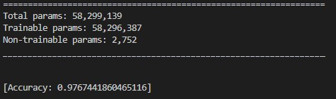

# gesture-recognition
Gesture recognition using OpenCV for pre-trained hand tracking via landmark localization. Gestures are learned by a complex Convolutional Neural Network (CNN) Deep Learning architecture called AlexNet. It has a total of 5 convolutional layers with pooling and batch norm layers. Model tested with "palm", "up", and "down" hand gestures and scored 98% on accuracy with test data.

