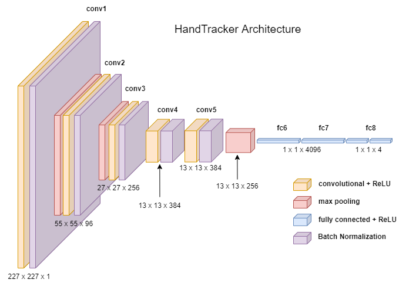
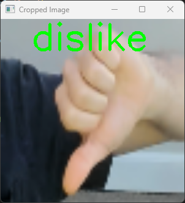

Hand tracking and gesture recognition using two trained AlexNet models.  
- HandTracker and GestureNet trained on the [HaGRID Dataset](https://www.kaggle.com/datasets/kapitanov/hagrid): 
- AlexNet from [ImageNet Classification with Deep Convolutional
Neural Networks](https://proceedings.neurips.cc/paper/2012/file/c399862d3b9d6b76c8436e924a68c45b-Paper.pdf) paper.

## Installing / Running
1. Install required Python packages:
```bash
pip install -r requirements.txt
```
2. Run main.py to test the models using your webcam!
```shell
python main.py
```

# HandTracker 
HandTracker crops an image to just one hand. For each hand gesture, the HaGRID dataset contains 4 x, y pixel coordinates that represent a crop-box around a sample’s hand. We can use this to train a model that takes an image as an input and outputs 4 float values representing pixel coordinates. We can use the AlexNet architecture to take in an input image of size 227x277x1and train a model to predict 4 float values. See the diagram below for the HandTracker architecture.



## HandTracker Training Metrics


# GestureNet
GestureNet takes the output from HandTracker and crops the input image to the area of interest. We train this model on classification of 4 class labels: ‘like’, ‘dislike’, ‘palm’ and 'no_gesture'. See the diagram below for the GestureNet architecture.


## GestureNet Training Metrics


## HandTracker and GestureNet Demo
<p float="left">
  
  
  
</p>
